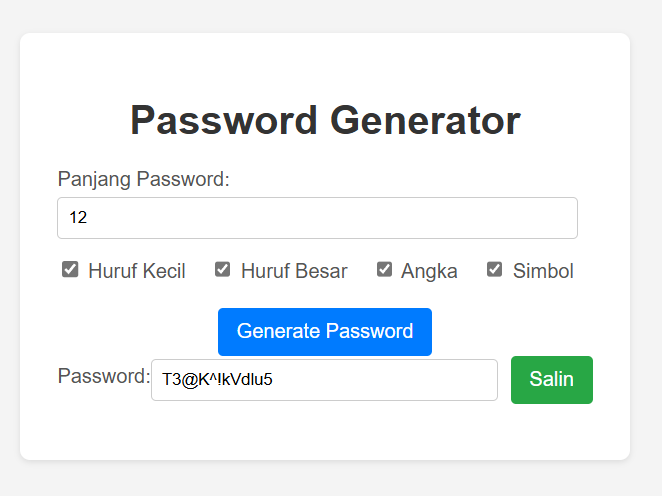

# 🔐 Password Generator Web App

A simple yet effective password generator built with JavaScript. Instantly generate secure, customizable passwords directly in your browser.

## 🙌 Acknowledgements

This project was created for educational and portfolio purposes.

## 🖼️ Preview




## 🎯 Features

- ✅ Generate random secure passwords
- ✅ Choose length (8–32 characters)
- ✅ Toggle symbols, numbers, uppercase, lowercase
- ✅ Copy to clipboard functionality

## 🚀 Live Demo

[Click here to try it now](https://ReyGaCuek.github.io/password-generator)

## 🛠️ Built With

- HTML5
- CSS3
- JavaScript

## 📦 How to Use Locally

```bash
git clone https://github.com/ReyGaCuek/password-generator.git
cd password-generator
```

## 📄 License

This project is licensed under the MIT License – see the [LICENSE](LICENSE) file for details.
